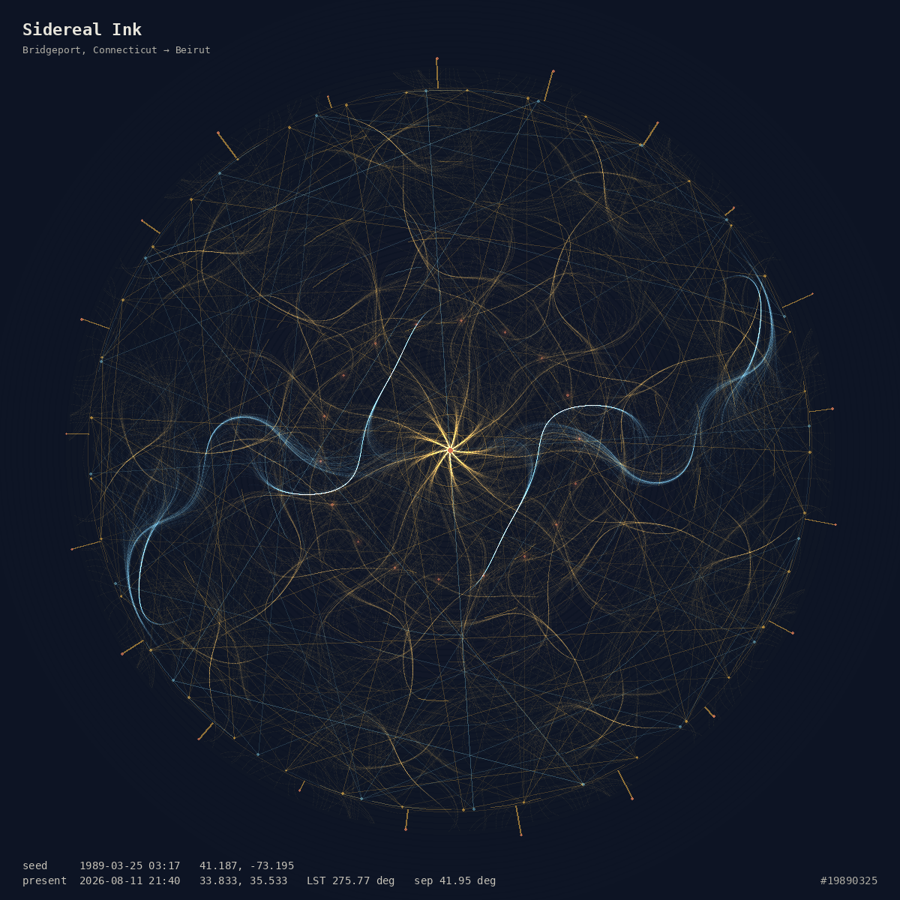

# Sidereal Ink

A generative figure drawn from moments in time and places on earth — and a cipher only those moments can open.

Each moment's angle is its **local sidereal time**, computed from Julian day → Greenwich mean sidereal time → plus longitude. Rotational orders, chord counts, spokes, petals and rings come from digit sums of the date. When two moments are in play, the great-circle arc between their places rotates one layer out of register with the other, and each latitude shears its own flow field.

Nothing in the image is decorative. Every mark is downstream of an input.



## What it does

- **Draws** a figure from one moment, or from two moments in relation
- **Encrypts** a message into the outer glyph ring, keyed to those exact moments
- **Decodes** the geometry back into language — an audited table plus a generated transmission
- **Renders** a lapse — one minute of 1440px video at 60fps by default — or a PNG frame sequence
- **Emails** finished renders, when deployed with the hosted service

## Repository layout

```
site/            the whole artwork, one HTML file, no build step
service/         optional hosted renderer
  worker/        Cloudflare Worker — API, queue, R2, email
  container/     Python + ffmpeg renderer
docs/            philosophy, standalone Python lapse renderer
```

## Run it

The artwork needs no build and no server:

```bash
open site/index.html
```

Two caveats when opening from the filesystem: geolocation is blocked outside HTTPS, and some browsers restrict canvas capture. Both work once deployed.

## Deploy the static site

Cloudflare Workers with static assets:

```bash
cd site
npx wrangler deploy --assets . --name sidereal-ink-site
```

Or drag the `site` folder into Netlify Drop, Cloudflare Pages, or GitHub Pages.

The name matters if you also run the render service: that Worker is `sidereal-ink` and
serves this same site alongside its API. Publishing a static-assets Worker over it would
remove `/api/render`, and the front end would fall back to browser rendering without
saying anything was wrong.

## Deploy the render service

Browser rendering blocks the UI thread — that's a JavaScript constraint, not a bug to optimise away. It also stops when the tab is backgrounded, because browsers clamp timers in hidden tabs. The service moves rendering to a container so you can queue several, close the tab, and get an email when they're done.

**[`DEPLOY.md`](DEPLOY.md) is the runbook** — what's already provisioned, what still has to be bought or created, the deploy sequence, and the traps. [`service/README.md`](service/README.md) is the reference for how the thing is built.

Requires the Cloudflare Workers paid plan (Containers and Queues) and a Resend account. Written and tested, but never yet run against live infrastructure.

The front end finds out for itself. On load it asks once whether `/api/render` exists: if it does, the render card grows an email field and lapses are submitted to the server, polled, and linked when they finish. If it doesn't — a static host, or a file opened from disk — nothing is said about it and the in-browser renderer handles the job as before. PNG frame sequences always render in the browser, since the service emits mp4. A job the server refuses can be moved to the browser with one click.

## The three kinds of output, and how much to trust each

**The arithmetic is exact.** Sidereal time, great-circle distance, digit reduction, the aspect angles. These are computed, verifiable, and identical across the browser and Python implementations.

**The cipher is real.** A 32-bit key hashed from the moments' angles, coordinates and roots, driving a mulberry32 keystream. Genuinely reversible; genuinely locked to those inputs. It is a puzzle, not security — 32 bits falls to brute force. Don't put secrets in it.

**The transmission is a convention.** The dark panel indexes fixed word banks with the computed values. Same numbers, same sentence, always. It is a decoding scheme this piece defines, not a message recovered from the sky. The decode table shows exactly which number selected which phrase, so it can be audited rather than believed.

## Licence

MIT — see [LICENSE](LICENSE).
